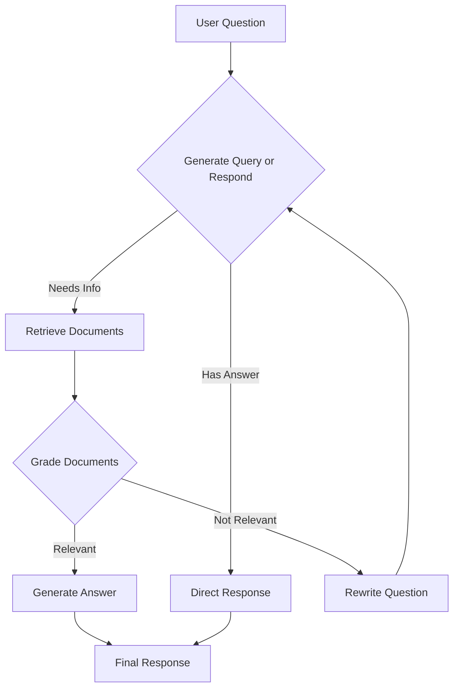

# 🤖 Agentic RAG System

<div align="center">


**An intelligent document retrieval and question-answering system powered by LangGraph and OpenAI**

[Demo](#-demo) • [Features](#-features) • [Installation](#-installation) • [Usage](#-usage) • [Architecture](#-architecture) • [Contributing](#-contributing)

</div>

---

## 📋 Overview

The **Agentic RAG System** is a sophisticated Retrieval-Augmented Generation (RAG) application that intelligently decides when to retrieve documents, grade their relevance, and generate accurate responses. Built with LangGraph's agentic workflow capabilities, it provides a transparent, step-by-step view of the AI's decision-making process.

### ✨ What makes it "Agentic"?

Unlike traditional RAG systems that always retrieve documents, this system makes intelligent decisions:
- 🧠 **Smart Decision Making**: Determines whether to search documents or respond directly
- 📊 **Document Grading**: Evaluates relevance of retrieved documents
- 🔄 **Query Rewriting**: Automatically improves questions for better retrieval
- 👁️ **Transparent Process**: Shows every step of the AI's reasoning

---

## 🚀 Features

### 🎯 Core Capabilities
- **Intelligent Document Processing**: Automatically fetches, chunks, and indexes web documents
- **Agentic Workflow**: Uses LangGraph for sophisticated decision-making
- **Real-time Chat Interface**: Interactive Q&A with conversation history
- **Document Grading**: Evaluates retrieved content for relevance
- **Query Optimization**: Automatically rewrites questions for better results

### 🖥️ User Experience
- **Beautiful UI**: Modern Streamlit interface with gradient themes
- **Progress Tracking**: Real-time feedback during system initialization
- **Step Visualization**: See exactly how the AI processes each query
- **Error Handling**: Graceful degradation with informative error messages
- **Responsive Design**: Works seamlessly on different screen sizes

### 🔧 Technical Features
- **Multiple Document Sources**: Support for various web URLs
- **Vector Search**: Semantic similarity using OpenAI embeddings
- **State Management**: Persistent chat history and system state
- **Modular Architecture**: Clean separation of concerns
- **Extensible Design**: Easy to add new document sources and processing steps

---

## 🎬 Demo

### System Architecture Flow


### Sample Interaction
```
👤 User: "What does Lilian Weng say about types of reward hacking?"

🤖 Agent Workflow:
├── 🔍 generate_query_or_respond: Decides to retrieve documents
├── 📚 retrieve: Searches for "types of reward hacking"  
├── ✅ grade_documents: Documents are relevant
└── 💡 generate_answer: Creates final response

📝 Response: "Lilian Weng categorizes reward hacking into two types: 
environment or goal misspecification, and reward tampering..."
```

---

## ⚡ Quick Start

### Prerequisites
- Python 3.8+
- OpenAI API Key

### 1-Minute Setup
```bash
# Clone the repository
git clone https://github.com/yourusername/agentic-rag-system.git
cd agentic-rag-system

# Install dependencies
pip install -r requirements.txt

# Run the application
streamlit run app.py
```

### Configuration
1. Open the application in your browser
2. Enter your OpenAI API key in the sidebar
3. Add document URLs (default: Lilian Weng's blog posts)
4. Click "Initialize RAG System"
5. Start asking questions!

---

## 🛠️ Installation

### Using pip
```bash
pip install streamlit langchain langchain-community langchain-openai langgraph langchain-text-splitters pydantic
```

### Using conda
```bash
conda create -n agentic-rag python=3.10
conda activate agentic-rag
pip install -r requirements.txt
```

---

## 📖 Usage

### Basic Usage

1. **Initialize the System**
   ```python
   # Add your document URLs
   urls = [
       "https://example.com/document1",
       "https://example.com/document2"
   ]
   
   # The system will automatically:
   # - Fetch documents
   # - Create embeddings  
   # - Build the agentic workflow
   ```

2. **Ask Questions**
   ```
   "What are the main concepts discussed in the documents?"
   "Can you explain the methodology used?"
   "What are the key findings?"
   ```

3. **View Processing Steps**
   - Each response shows the AI's decision process
   - See which documents were retrieved
   - Understand why certain paths were taken

### Advanced Usage

#### Custom Document Processing
```python
from agentic_rag import AgenticRAGSystem

# Initialize with custom parameters
rag_system = AgenticRAGSystem(
    api_key="your-openai-key",
    chunk_size=1000,
    chunk_overlap=200
)

# Process documents
urls = ["https://your-documents.com"]
result = rag_system.process_documents(urls)

# Query the system
response = rag_system.query("Your question here")
```

---

## 🏗️ Architecture

### System Components

```
┌─────────────────────────────────────┐
│           Streamlit UI              │
├─────────────────────────────────────┤
│        AgenticRAGSystem             │
├─────────────────────────────────────┤
│          LangGraph Workflow         │
│  ┌─────┐  ┌─────┐  ┌─────┐  ┌─────┐ │
│  │Gen. │→ │Retr.│→ │Grade│→ │Ans. │ │
│  └─────┘  └─────┘  └─────┘  └─────┘ │
├─────────────────────────────────────┤
│       LangChain Components          │
│  • Document Loaders                 │
│  • Text Splitters                   │
│  • Vector Stores                    │
│  • Embeddings                       │
└─────────────────────────────────────┘
```

### Workflow Nodes

| Node | Purpose | Input | Output |
|------|---------|--------|--------|
| `generate_query_or_respond` | Decide action | User question | Tool call or direct response |
| `retrieve` | Fetch documents | Search query | Retrieved documents |
| `grade_documents` | Assess relevance | Question + Documents | Relevance score |
| `rewrite_question` | Improve query | Original question | Rewritten question |
| `generate_answer` | Create response | Question + Context | Final answer |

### Data Flow

1. **Input Processing**: User question → Message state
2. **Decision Making**: Agent chooses to retrieve or respond
3. **Document Retrieval**: Semantic search in vector store
4. **Relevance Grading**: AI evaluates document quality
5. **Response Generation**: Creates answer using relevant context

---

## 🎛️ Configuration

### Environment Variables
```bash
OPENAI_API_KEY=your_openai_api_key_here
LANGCHAIN_TRACING_V2=true  # Optional: Enable LangSmith tracing
LANGCHAIN_API_KEY=your_langsmith_key  # Optional: For monitoring
```

### System Parameters
```python
# Document Processing
CHUNK_SIZE = 500          # Size of document chunks
CHUNK_OVERLAP = 100       # Overlap between chunks
MAX_DOCUMENTS = 10        # Maximum documents to process

# Model Configuration  
TEMPERATURE = 0           # Deterministic responses
MODEL = "gpt-4o-mini"    # OpenAI model to use

# UI Configuration
MAX_CHAT_HISTORY = 50     # Messages to keep in memory
```